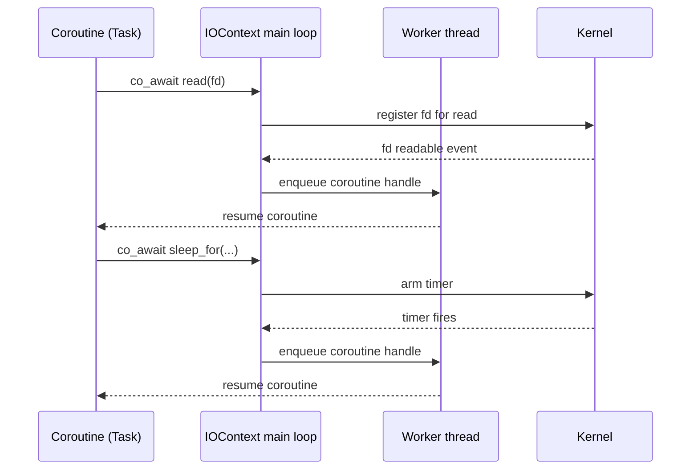

# Concurrency, Coroutines, and Event Loop

This document explains how `libspaznet` schedules work, how coroutines move between threads, and why coroutine-native handlers cannot be mixed with ad-hoc lambdas.

## Core Execution Model

- **IOContext** owns the event loop, worker threads, timer wheel, and platform-specific I/O demultiplexer.
- **Task** is a coroutine return type; its promise (`TaskPromise`) stores a continuation handle so `co_await` chains resume correctly.
- **TaskQueue** is a multi-producer/single-consumer queue per worker thread; enqueue is atomic, dequeue is mutex-protected to simplify correctness.
- **PlatformIO** (epoll/kqueue/poll/IOCP) translates OS events into coroutine resumes; pending I/O registrations store raw coroutine handles for atomic swaps.

```mermaid
flowchart LR
    subgraph OS[Kernel I/O + Timers]
        EVT[fd ready / timer due]
    end
    EVT --> |wait()/poll| PIO[PlatformIO]
    PIO --> |Event list| LOOP[IOContext::process_io_events]
    LOOP --> |coroutine handles| SCHED[Round-robin scheduler]
    SCHED --> |enqueue Task| Q1[TaskQueue 0]
    SCHED --> |enqueue Task| QN[TaskQueue N-1]
    Q1 --> |worker threads resume coroutines| WORKERS
    QN --> WORKERS[Worker Threads]
```

## Threading and Coroutine Handoffs

- `IOContext::run` spins the main loop and also starts N worker threads; all share the same `IOContext`.
- Coroutines may start on the main loop, be resumed on a worker, and bounce between workers as they `co_await` I/O or timers. Handles are portable because the continuation is stored in the promise, not the stack.
- `register_io` places coroutine handles into `pending_io_`; when the OS reports readiness, the handles are atomically extracted and rescheduled.
- Timers are placed in a min-heap and, when due, their coroutine handles are also rescheduled.
- Workers and the main loop both drain queues: every resume that yields again must be resubmitted via `schedule`.



## Why Lambdas and Coroutines Must Not Be Mixed

The scheduler expects **coroutine-aware callables** that return `Task` and yield via `co_await`. Mixing raw lambdas (e.g., `std::function<void()>`, thread-pool callbacks, or ad-hoc captures) with coroutines breaks this contract:

- **No continuation wiring:** Lambdas do not carry a `TaskPromise::continuation`, so resuming through a lambda loses the coroutine chain and can deadlock waits.
- **Wrong lifetime:** Lambdas capture by value and run immediately on the calling thread; they are not reentrant resumable frames. Passing a coroutine handle into a lambda that executes later risks dangling captures or double-destruction when the coroutine frame is already destroyed in `Task`'s destructor.
- **Thread confusion:** Lambdas invoked by external threads bypass `IOContext::schedule`, so they may resume a coroutine on a thread that is not draining the queues, violating the library's scheduling invariants and causing data races against `pending_io_` or timer structures.
- **Type mismatch:** Handlers in `libspaznet` are virtual methods returning `Task`. A lambda with `auto` return cannot satisfy the vtable contract and cannot be stored in the places that expect `Task`.

## What to Do Instead

- **Write coroutine functions that return `Task`.** Define named member functions or free functions with `co_await` and let the scheduler handle thread hops.

```cpp
Task MyHTTPHandler::handle_request(const HTTPRequest& req,
                                   HTTPResponse& res,
                                   Socket& sock) {
    auto read = co_await sock.read_some(buffer);
    co_await ctx.sleep_for(10ms);
    res.status_code = 200;
    res.body.assign(read.begin(), read.end());
    co_return;
}
```

- **Bridge callbacks by scheduling Tasks.** If an external API gives you a callback, convert it to a coroutine task and push it through `IOContext::schedule`.

```cpp
void on_external_ready(IOContext& ctx, ExternalEvent ev) {
    ctx.schedule([](IOContext& ctx, ExternalEvent ev) -> Task {
        // Safe: coroutine frame owns its continuation and lifetime
        co_await ctx.sleep_for(0ms); // yield into scheduler
        co_return;
    }(ctx, ev));
}
```

- **Use awaiters for simple values.** The helper `make_awaiter(value)` produces an already-ready awaitable without mixing in lambdas.
- **Keep coroutine ownership with Task.** Do not stash raw `std::coroutine_handle` inside arbitrary lambdas; always wrap them in `Task` so destruction and rescheduling remain centralized.

## Practical Guidance

- Prefer one `IOContext` per process; share it across handlers.
- Keep handler methods coroutine-based; avoid blocking or OS threads that bypass the scheduler.
- When you need concurrency, start additional coroutines (`IOContext::schedule(Task{...})`) instead of launching background threads with lambdas.
- If you must integrate with a callback-style library, immediately hop into the coroutine world via a small `Task` wrapper and let `IOContext` control resumption.

## Failure Modes When Mixing

- Coroutines resume on arbitrary threads, causing races against `pending_io_` spinlock or timer heap mutex.
- Continuations are dropped; `co_await` never resumes, appearing as a hang.
- A `Task` gets destroyed while a lambda still holds its raw handle, leading to `resume` on a destroyed frame (undefined behavior).
- Handler vtables are violated, so HTTP/WebSocket/TCP dispatch cannot call your handler at all.

Keep coroutine boundaries clean: once you start with `Task`, stay with coroutines and let the `IOContext` scheduler be the only component that moves work across threads.
