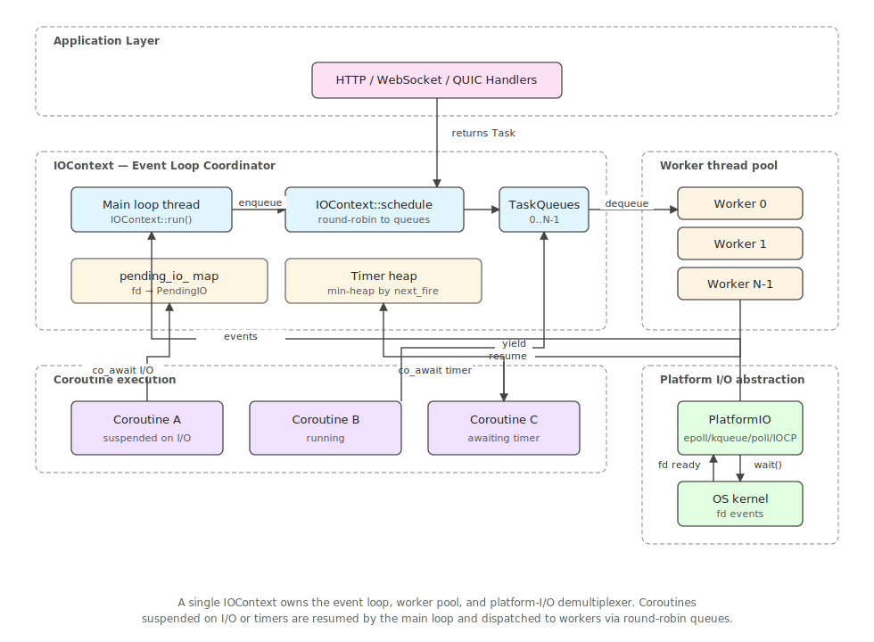
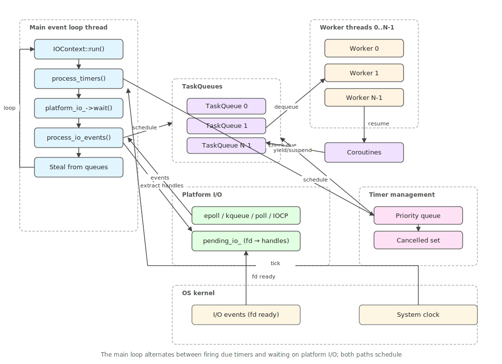
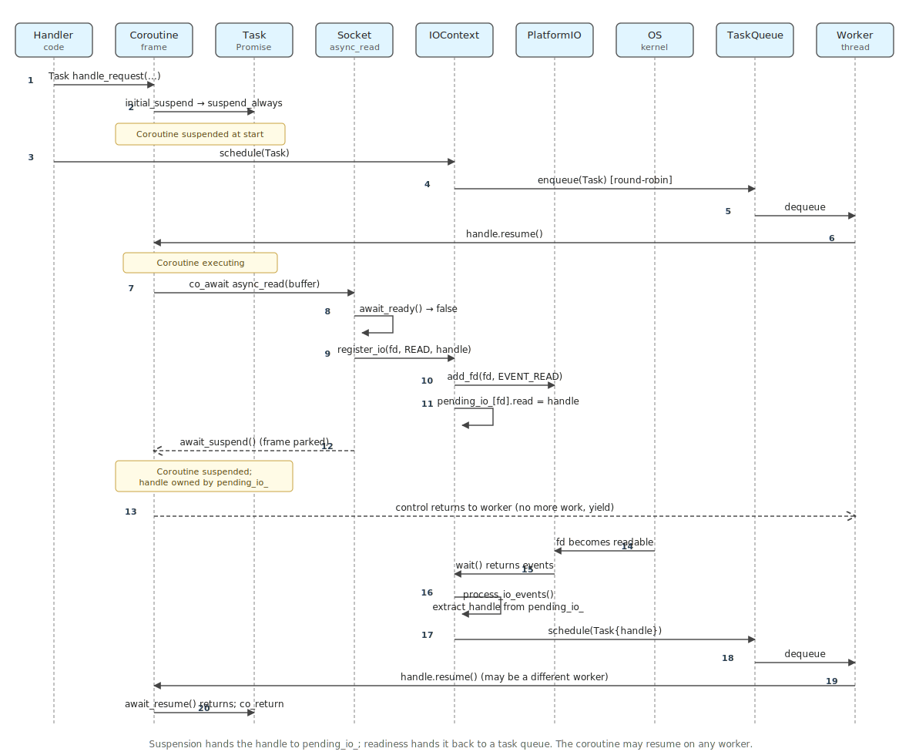
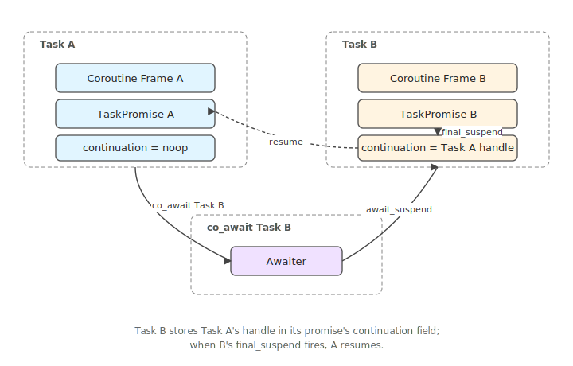
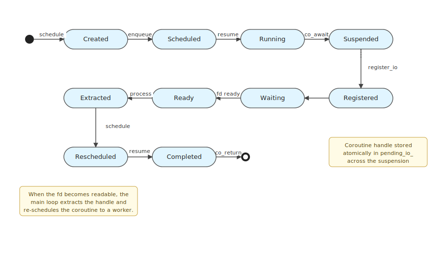
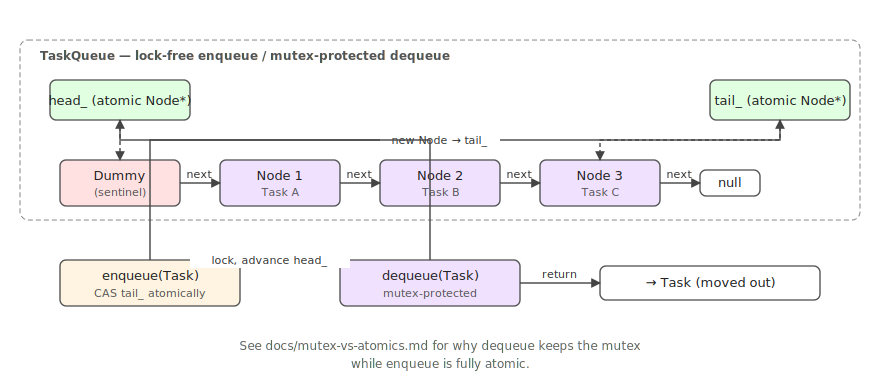
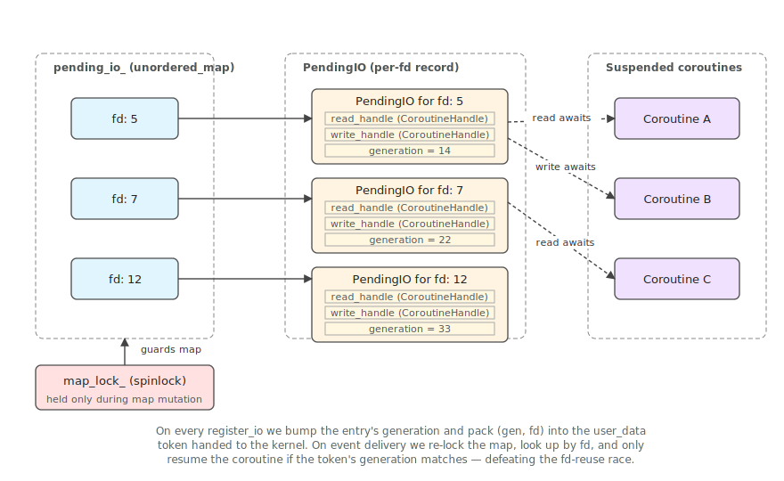
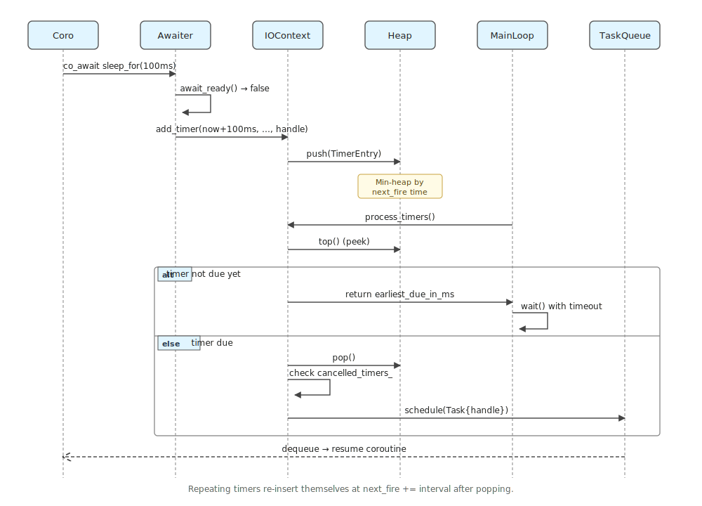

# Concurrency, Coroutines, and Event Loop

This document explains how `libspaznet` schedules work, how coroutines move between threads, and why coroutine-native handlers cannot be mixed with ad-hoc lambdas.

## Architecture Overview



## Core Execution Model

- **IOContext** owns the event loop, worker threads, timer wheel, and platform-specific I/O demultiplexer.
- **Task** is a coroutine return type; its promise (`TaskPromise`) stores a continuation handle so `co_await` chains resume correctly.
- **TaskQueue** is a multi-producer/multi-consumer queue. Both enqueue and dequeue take a single `std::mutex` — the original lock-free enqueue had a use-after-free against the mutex-protected dequeue. See `mutex-vs-atomics.md` for the broader discussion of when atomics are not enough.
- **PlatformIO** (epoll/kqueue/poll/IOCP) translates OS events into coroutine resumes. Each registration carries a per-fd generation counter packed into the user_data handed to the kernel; on event delivery the IOContext verifies the generation matches the current registration so that fd-reuse cannot resurrect a stale coroutine.



## Coroutine Lifecycle and I/O Suspension



## Task Continuation Chaining



## Complete I/O Operation Flow



## Threading and Coroutine Handoffs

- `IOContext::run` spins the main loop and also starts N worker threads; all share the same `IOContext`.
- Coroutines may start on the main loop, be resumed on a worker, and bounce between workers as they `co_await` I/O or timers. Handles are portable because the continuation is stored in the promise, not the stack.
- `register_io` places coroutine handles into `pending_io_` under `map_lock_`, bumps the entry's generation counter, and hands the packed `(generation, fd)` token to the platform demultiplexer. When the OS reports readiness the token comes back unchanged; `process_io_events` re-acquires the lock, looks up the entry, and only resumes the coroutine if the generation still matches.
- Timers are placed in a min-heap and, when due, their coroutine handles are also rescheduled.
- Workers and the main loop both drain queues: every resume that yields again must be resubmitted via `schedule`.
- `wait()` retries internally on `EINTR`, and a peer half-close (`EPOLLHUP` / `EV_EOF` / `POLLHUP`) wakes the read-waiter so `recv()` returns 0 instead of hanging.

## TaskQueue Internal Structure



## Pending I/O Map Structure



## Timer Management Flow



## Synchronization Primitives Inventory

The whole library uses exactly **five** synchronization primitives.
The rest of the cross-thread state lives in `std::atomic<…>`.

| Location | Primitive | Scope |
|---|---|---|
| `TaskQueue::mutex_` (`io_context.hpp`) | `std::mutex` | Held briefly on enqueue and dequeue; the only correctness guarantee for the singly-linked task list. |
| `IOContext::timer_mutex_` (`io_context.hpp`) | `std::mutex` | Protects the timer min-heap, the cancelled-id set, and the suspended-task map as a single transaction. |
| `IOContext::map_lock_` (`io_context.hpp`) | `std::mutex` | Structural guard for the `pending_io_` map (insert / find / erase). Held across the `add_fd` / `modify_fd` / `remove_fd` call into the platform layer so a rehash can't invalidate the entry mid-update and side-table mutations stay serialized. A mutex, not a spinlock, so waiters park rather than spin while the holder is blocked in that syscall. |
| `Server::listen_fds_mutex_` (`server.hpp`) | `std::mutex` | Guards the listening-socket vector across `listen_tcp()` and `stop()`. |
| `Server::client_fds_mutex_` (`server.hpp`) | `std::mutex` | Guards the active-client-fd set that `Server::stop()` walks to `shutdown(2)` every in-flight client and drain its coroutine. |

A `std::once_flag` in the Windows-only WSAStartup helper is the only
other locking primitive; it fires once per process and never recurs.
`docs/mutex-vs-atomics.md` covers the rationale for each entry.

## Why Lambdas and Coroutines Must Not Be Mixed

The scheduler expects **coroutine-aware callables** that return `Task` and yield via `co_await`. Mixing raw lambdas (e.g., `std::function<void()>`, thread-pool callbacks, or ad-hoc captures) with coroutines breaks this contract:

- **No continuation wiring:** Lambdas do not carry a `TaskPromise::continuation`, so resuming through a lambda loses the coroutine chain and can deadlock waits.
- **Wrong lifetime:** Lambdas capture by value and run immediately on the calling thread; they are not reentrant resumable frames. Passing a coroutine handle into a lambda that executes later risks dangling captures or double-destruction when the coroutine frame is already destroyed in `Task`'s destructor.
- **Thread confusion:** Lambdas invoked by external threads bypass `IOContext::schedule`, so they may resume a coroutine on a thread that is not draining the queues, violating the library's scheduling invariants and causing data races against `pending_io_` or timer structures.
- **Type mismatch:** Handlers in `libspaznet` are virtual methods returning `Task`. A lambda with `auto` return cannot satisfy the vtable contract and cannot be stored in the places that expect `Task`.

## What to Do Instead

- **Write coroutine functions that return `Task`.** Define named member functions or free functions with `co_await` and let the scheduler handle thread hops.

```cpp
Task MyHTTPHandler::handle_request(const HTTPRequest& req,
                                   HTTPResponse& res,
                                   Socket& sock) {
    auto read = co_await sock.read_some(buffer);
    co_await ctx.sleep_for(10ms);
    res.status_code = 200;
    res.body.assign(read.begin(), read.end());
    co_return;
}
```

- **Bridge callbacks by scheduling Tasks.** If an external API gives you a callback, convert it to a coroutine task and push it through `IOContext::schedule`.

```cpp
void on_external_ready(IOContext& ctx, ExternalEvent ev) {
    ctx.schedule([](IOContext& ctx, ExternalEvent ev) -> Task {
        // Safe: coroutine frame owns its continuation and lifetime
        co_await ctx.sleep_for(0ms); // yield into scheduler
        co_return;
    }(ctx, ev));
}
```

- **Use awaiters for simple values.** The helper `make_awaiter(value)` produces an already-ready awaitable without mixing in lambdas.
- **Keep coroutine ownership with Task.** Do not stash raw `std::coroutine_handle` inside arbitrary lambdas; always wrap them in `Task` so destruction and rescheduling remain centralized.

## Practical Guidance

- Prefer one `IOContext` per process; share it across handlers.
- Keep handler methods coroutine-based; avoid blocking or OS threads that bypass the scheduler.
- When you need concurrency, start additional coroutines (`IOContext::schedule(Task{...})`) instead of launching background threads with lambdas.
- If you must integrate with a callback-style library, immediately hop into the coroutine world via a small `Task` wrapper and let `IOContext` control resumption.

## Failure Modes When Mixing

- Coroutines resume on arbitrary threads, causing races against the `pending_io_` map or timer heap mutex (`map_lock_` is taken on every register / process step; an out-of-band resume sidesteps it).
- Continuations are dropped; `co_await` never resumes, appearing as a hang.
- A `Task` gets destroyed while a lambda still holds its raw handle, leading to `resume` on a destroyed frame (undefined behavior).
- Handler vtables are violated, so HTTP/WebSocket/TCP dispatch cannot call your handler at all.

Keep coroutine boundaries clean: once you start with `Task`, stay with coroutines and let the `IOContext` scheduler be the only component that moves work across threads.


