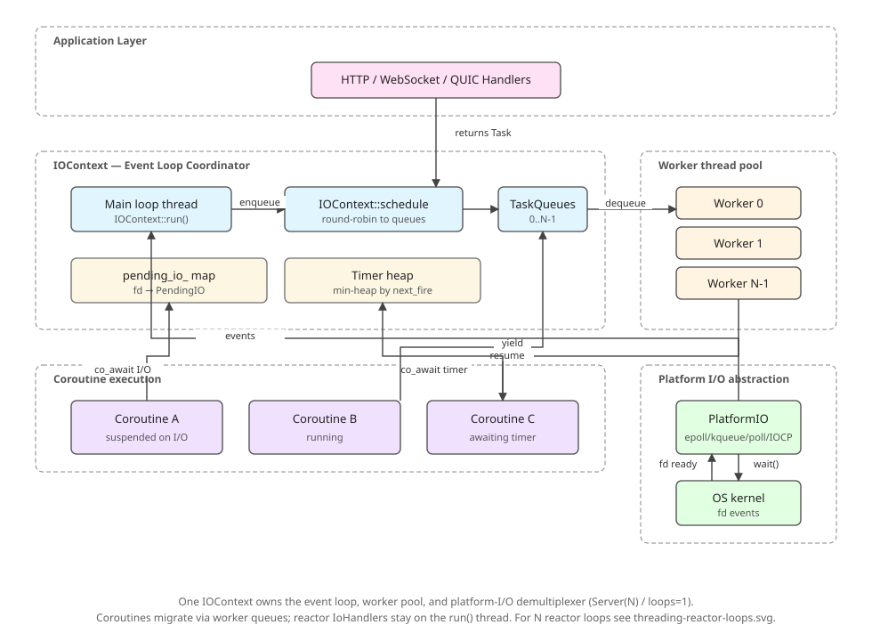
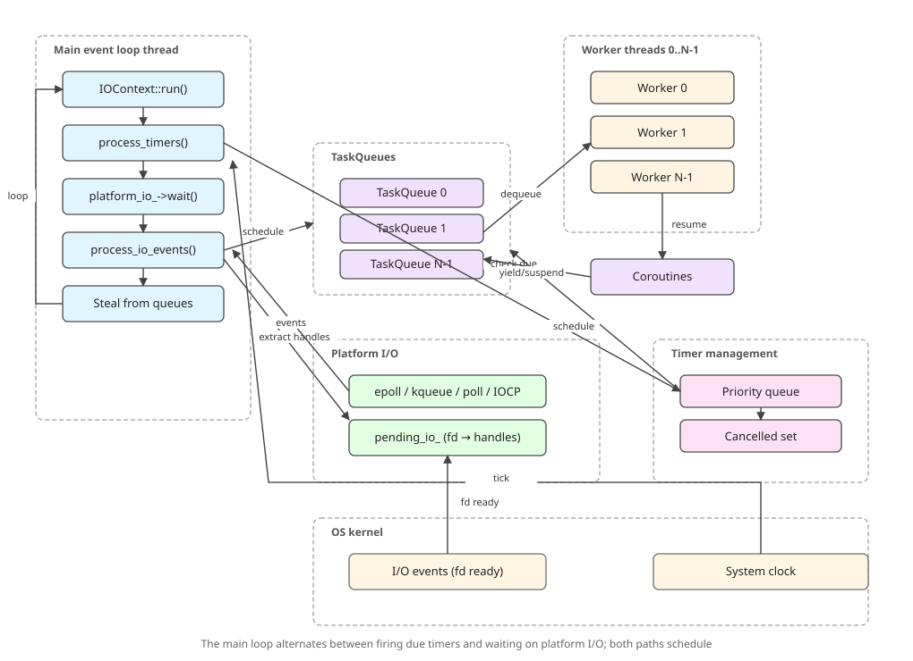
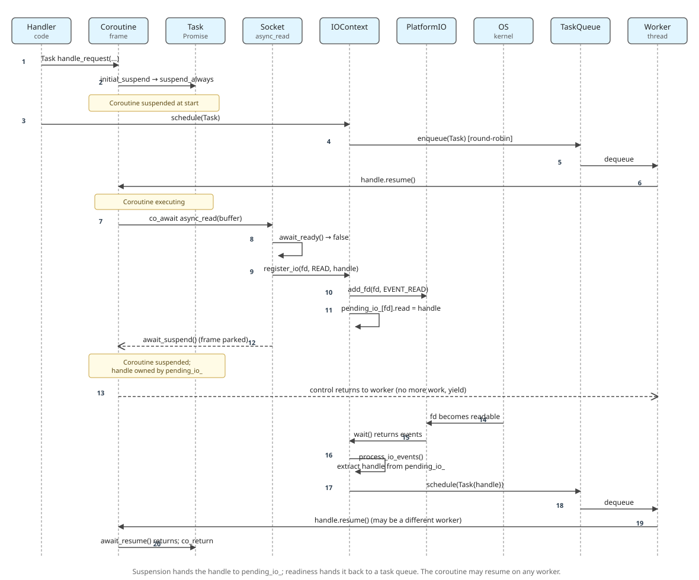
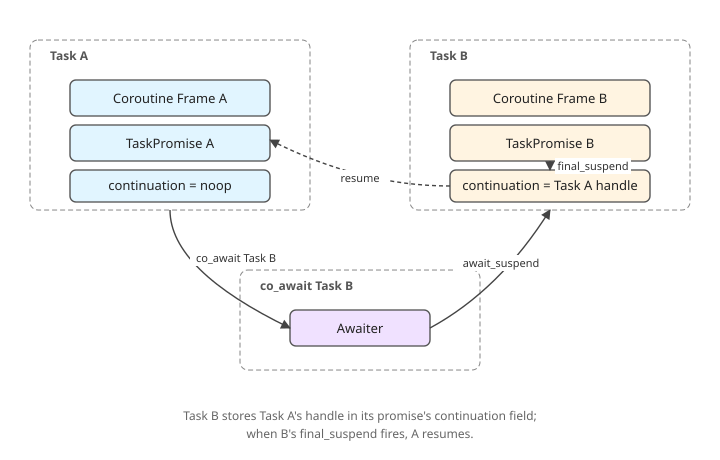
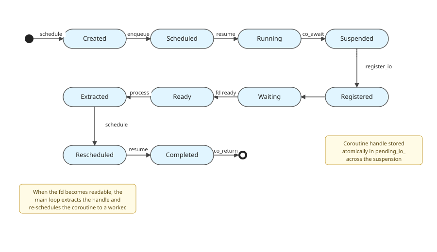
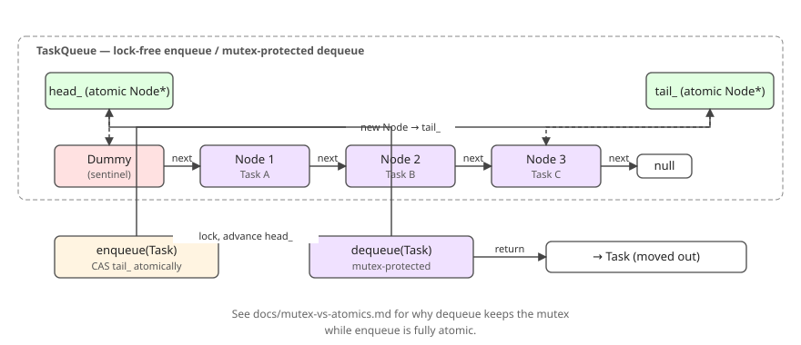
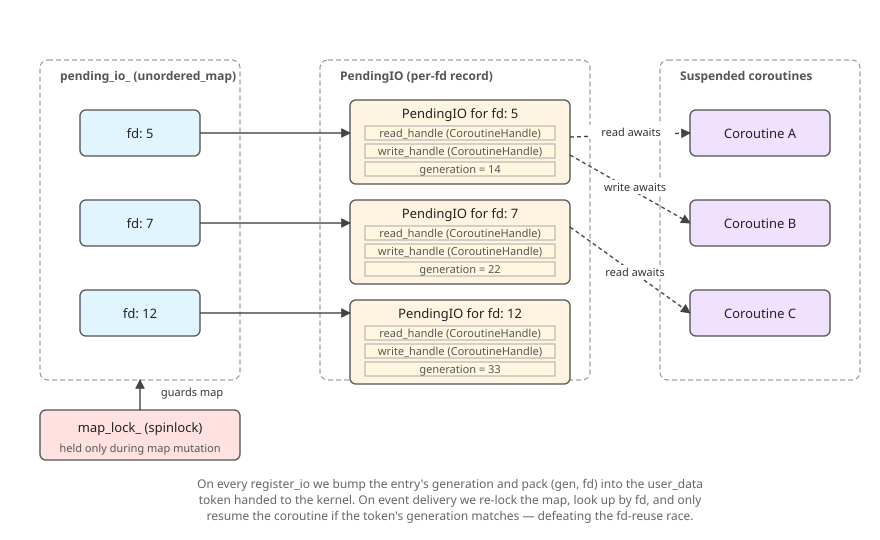
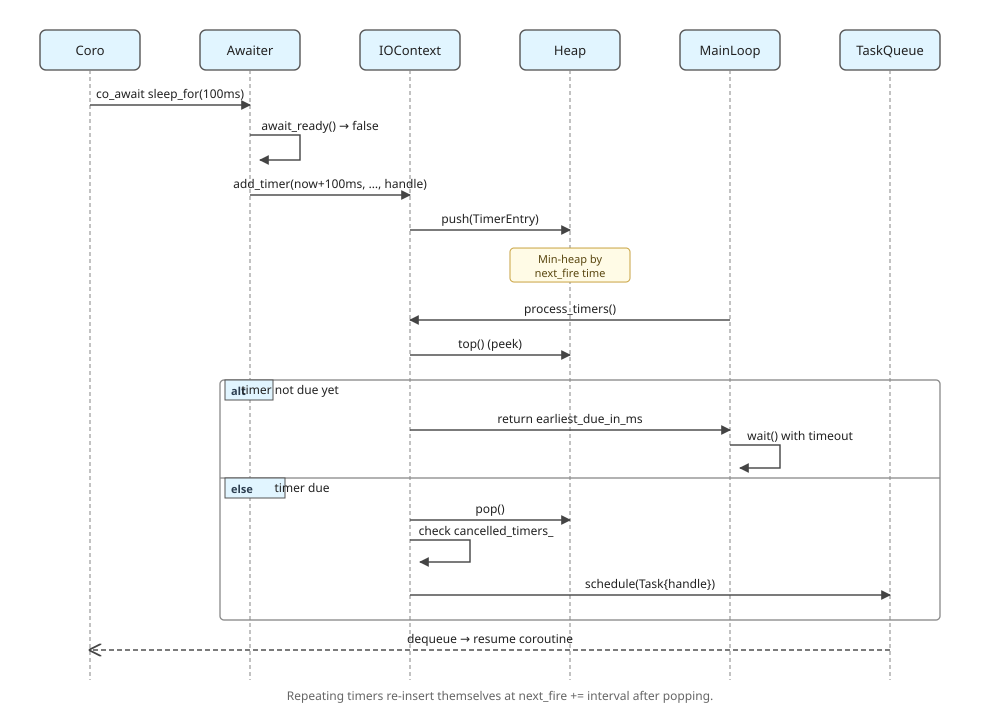

# Concurrency, Coroutines, and Event Loop

This document explains how `libspaznet` schedules work, how coroutines move between threads, and why coroutine-native handlers cannot be mixed with ad-hoc lambdas.

> **Scope note (2026-08-12):** everything below describes the coroutine
> runtime specifically (`Task`/`ValueTask`, `schedule()`,
> `register_io(fd, events, CoroutineHandle)`), which remains exactly as
> documented — no public coroutine API changed. `IOContext` now also
> hosts a separate, lambda-based reactor runtime underneath it:
> `IoHandler` (a virtual `on_readable`/`on_writable`/`on_error`
> interface), `IOContext::post(std::function<void()>)`,
> `IOContext::add_timer_callback(...)`, `IOContext::defer_destruction(...)`
> (a reap list for safe self-destruction inside a callback), and
> `BufferedConnection` (`include/libspaznet/reactor/buffered_connection.hpp`)
> built on top of them. The coroutine path is one `IoHandler`
> implementation (`CoroutineResumeHandler`) among others, not a
> privileged special case, and it is entirely optional at build time via
> `-DSPAZNET_ENABLE_COROUTINES=OFF` (see `CHANGELOG.md`). "Do not mix
> lambdas and coroutines" still holds *within* the coroutine runtime —
> do not stash a `CoroutineHandle` in a bare `std::function` instead of
> a `Task` — but it does not apply to this separate reactor runtime,
> which is lambdas and callbacks by design and has no coroutine
> dependency at all. `Server`/`Socket` still only speak the coroutine
> runtime internally (see `CHANGELOG.md`'s Milestone 5 entry), though
> `Server::set_connection_factory`/`set_sync_datagram_handler` let a
> reactor-side handler ride along without needing one. HTTP/1.1, HTTP/2,
> UDP, QUIC/HTTP3, and WebSocket dispatchers now each have a
> coroutine-free reactor counterpart (`make_reactor_dispatcher`, see
> `docs/http.md` and `docs/websocket.md`); WebSocket's reactor counterpart
> uses its own synchronous `Handler`/`Connection` interface rather than
> reusing the coroutine one, since sending a frame is a real suspension
> point on that side (see `docs/websocket.md`'s "Two dispatchers"
> section). HTTP/2's `Handler::handle_request` is now synchronous
> (`ResponseWriter`-based, like HTTP/1.1) under *both* of its
> dispatchers — its coroutine dispatcher just calls it as a plain
> function and `co_await`s the writer's completion internally; see
> `docs/http.md`'s "Two dispatchers" section for HTTP/2. The `threading`
> milestone landed `IOContext::post_to_io_thread`/`is_io_thread()` (see
> the new "Reactor Threading Model" section below) — every reactor
> dispatcher's `ResponseWriter` completion and cross-connection send now
> goes through it, and HTTP/2's former per-connection `recursive_mutex`
> is gone as a result. `-DSPAZNET_ENABLE_COROUTINES=OFF` now builds the
> core library, all five protocol libraries, every demo, and the full
> test suite with zero coroutine code compiled in — see
> `docs/coro-free-build.md` for the build matrix, the reactor
> state-machine authoring rules, and the connection-lifetime/re-entrancy
> rules every reactor dispatcher in this tree follows. A full rewrite of
> this document for the dual-runtime model is tracked as future work.

## Architecture Overview



## Core Execution Model

- **IOContext** owns the event loop, worker threads, timer wheel, and platform-specific I/O demultiplexer.
- **Task** is a coroutine return type; its promise (`TaskPromise`) stores a continuation handle so `co_await` chains resume correctly.
- **TaskQueue** is a multi-producer/multi-consumer queue. Both enqueue and dequeue take a single `std::mutex` — the original lock-free enqueue had a use-after-free against the mutex-protected dequeue. See `mutex-vs-atomics.md` for the broader discussion of when atomics are not enough.
- **PlatformIO** (epoll/kqueue/poll/IOCP) translates OS events into coroutine resumes. Each registration carries a per-fd generation counter packed into the user_data handed to the kernel; on event delivery the IOContext verifies the generation matches the current registration so that fd-reuse cannot resurrect a stale coroutine.



## Coroutine Lifecycle and I/O Suspension



## Task Continuation Chaining



## Complete I/O Operation Flow



## Threading and Coroutine Handoffs

- `IOContext::run` spins the main loop and also starts N worker threads; all share the same `IOContext`.
- Coroutines may start on the main loop, be resumed on a worker, and bounce between workers as they `co_await` I/O or timers. Handles are portable because the continuation is stored in the promise, not the stack.
- `register_io` places coroutine handles into `pending_io_` under `map_lock_`, bumps the entry's generation counter, and hands the packed `(generation, fd)` token to the platform demultiplexer. When the OS reports readiness the token comes back unchanged; `process_io_events` re-acquires the lock, looks up the entry, and only resumes the coroutine if the generation still matches.
- Timers are placed in a min-heap and, when due, their coroutine handles are also rescheduled.
- Workers and the main loop both drain queues: every resume that yields again must be resubmitted via `schedule`.
- `wait()` retries internally on `EINTR`, and a peer half-close (`EPOLLHUP` / `EV_EOF` / `POLLHUP`) wakes the read-waiter so `recv()` returns 0 instead of hanging.

## Reactor Threading Model

The section above describes the coroutine runtime's threading model —
frames migrate freely between the main loop and worker threads because
each `Task` is self-contained. A reactor state machine (`BufferedConnection`
and everything built on it: `Http1Connection`, `Http2Connection`,
`WsConnection`, ...) is the opposite: its state lives in ordinary member
variables, and those are only ever safe to touch from one thread.

**Only one thread per `IOContext` ever calls `PlatformIO::wait()` and
invokes `on_readable()`/`on_writable()`** — the thread that called `run()`
(see `IOContext::run()`'s main loop and `process_io_events()`). Worker
threads spawned for `num_threads_ > 0` never call into `PlatformIO`
directly; they only drain `thread_queues_` (coroutine `Task`s) and
`callback_queues_` (plain `post()`ed callbacks). So a reactor connection's
own `on_data()`/`on_closed()` are single-threaded by construction, with no
lock needed, for exactly the same reason the diagram above shows
coroutines migrating between threads freely: there's only one "loop" per
`IOContext` in this codebase, and I/O readiness dispatch never leaves it.

The risk is anything that touches that same connection state from
*outside* that call chain — chiefly a `ResponseWriter` completion arriving
from a background thread, or one connection's handler reaching into a
different connection (WebSocket broadcast). `IOContext::post(fn)` doesn't
fix this: it round-robins across `callback_queues_`, which *any* worker
thread (or the main loop, interleaved between iterations) may drain —
exactly the mechanism that produced a real double-free in HTTP/2's
reactor dispatcher under concurrent deferred completions (see
`CHANGELOG.md`'s "HTTP/2 reactor dispatcher" entry), fixed at the time
with a per-connection `recursive_mutex`.

**`IOContext::post_to_io_thread(fn)`** replaces that mutex with affinity
instead of locking: it's backed by a queue drained *only* inside `run()`'s
own loop, never by `worker_thread()`. If the caller is already on the IO
thread, `fn` runs inline, synchronously — no queue hop, so a handler that
completes its `ResponseWriter` before returning (the common case) costs
exactly what it always did. Otherwise `fn` is queued and runs on the IO
thread's next iteration. `IOContext::is_io_thread()` exposes the same
check for assertions. Every reactor dispatcher's `ResponseWriter`
completion (`example/http`'s and `example/http2`'s `on_response_ready`)
and `websocket::reactor::Connection::send()` route through it, which is
why `Http2Connection` no longer needs a lock at all — every entry point
that mutates its state is now provably reached from one thread only,
enforced with `assert(ctx_.is_io_thread())` rather than a runtime lock.

`Server::stop()`'s reactor-connection teardown uses the same primitive for
the same reason: tearing down connections from `stop()`'s caller thread
(or a worker, under the old `post()`) while the IO thread might still be
mid-`on_readable()` for one of them is the identical hazard.

This does **not** mean the reactor runtime scales I/O demultiplexing
itself across cores — there is still exactly one `PlatformIO::wait()`
caller per `IOContext`. `num_threads_` workers add parallelism for
CPU-bound coroutine `Task`s and `post()`ed callbacks that don't touch
`BufferedConnection` state directly, not for the I/O readiness loop.
Sharding across N independent loops, each with its own connections
pinned at accept, is available via `Server(ServerConfig{.loops = N})`
(accept-and-shard). See [`reactor-threading.md`](reactor-threading.md).

TCP TLS follows the same affinity rule: reactor `BufferedConnection`
drives a memory-BIO `TlsStream` only from the IO thread, so it leaves
`io_mu_` off. Coroutine connections that share one `SSL*` across
tasks (`Socket::attach_tls`) call `enable_serialized_io()`. Accept→
factory TLS handoff is `thread_local` on the accept thread — no global
stash map. Lock inventory: `README.md` *Concurrency Primitives*.

## TaskQueue Internal Structure



## Pending I/O Map Structure



## Timer Management Flow



## Synchronization Primitives Inventory

The whole library uses exactly **five** synchronization primitives.
The rest of the cross-thread state lives in `std::atomic<…>`.

| Location | Primitive | Scope |
|---|---|---|
| `TaskQueue::mutex_` (`io_context.hpp`) | `std::mutex` | Held briefly on enqueue and dequeue; the only correctness guarantee for the singly-linked task list. |
| `IOContext::timer_mutex_` (`io_context.hpp`) | `std::mutex` | Protects the timer min-heap, the cancelled-id set, and the suspended-task map as a single transaction. |
| `IOContext::map_lock_` (`io_context.hpp`) | `std::mutex` | Structural guard for the `pending_io_` map (insert / find / erase). Held across the `add_fd` / `modify_fd` / `remove_fd` call into the platform layer so a rehash can't invalidate the entry mid-update and side-table mutations stay serialized. A mutex, not a spinlock, so waiters park rather than spin while the holder is blocked in that syscall. |
| `Server::listen_fds_mutex_` (`server.hpp`) | `std::mutex` | Guards the listening-socket vector across `listen_tcp()` and `stop()`. |
| `Server::client_fds_mutex_` (`server.hpp`) | `std::mutex` | Guards the active-client-fd set that `Server::stop()` walks to `shutdown(2)` every in-flight client and drain its coroutine. |

A `std::once_flag` in the Windows-only WSAStartup helper is the only
other locking primitive; it fires once per process and never recurs.
`docs/mutex-vs-atomics.md` covers the rationale for each entry.

## Why Lambdas and Coroutines Must Not Be Mixed

The scheduler expects **coroutine-aware callables** that return `Task` and yield via `co_await`. Mixing raw lambdas (e.g., `std::function<void()>`, thread-pool callbacks, or ad-hoc captures) with coroutines breaks this contract:

- **No continuation wiring:** Lambdas do not carry a `TaskPromise::continuation`, so resuming through a lambda loses the coroutine chain and can deadlock waits.
- **Wrong lifetime:** Lambdas capture by value and run immediately on the calling thread; they are not reentrant resumable frames. Passing a coroutine handle into a lambda that executes later risks dangling captures or double-destruction when the coroutine frame is already destroyed in `Task`'s destructor.
- **Thread confusion:** Lambdas invoked by external threads bypass `IOContext::schedule`, so they may resume a coroutine on a thread that is not draining the queues, violating the library's scheduling invariants and causing data races against `pending_io_` or timer structures.
- **Type mismatch:** Handlers in `libspaznet` are virtual methods returning `Task`. A lambda with `auto` return cannot satisfy the vtable contract and cannot be stored in the places that expect `Task`.

## What to Do Instead

- **Write coroutine functions that return `Task`.** Define named member functions or free functions with `co_await` and let the scheduler handle thread hops.

```cpp
// Illustrative coroutine handler shape, not the literal current
// HTTPHandler or HTTP/2 Handler interface (both are now synchronous,
// ResponseWriter-based — see docs/http.md). This still illustrates the
// general "coroutine function, not a lambda" rule for any code you write
// that talks directly to Task/IOContext::schedule, e.g. a custom
// coroutine dispatcher of your own.
Task MyHandler::handle_request(const Request& req,
                               Response& res,
                               Socket& sock) {
    auto read = co_await sock.read_some(buffer);
    co_await ctx.sleep_for(10ms);
    res.status_code = 200;
    res.body.assign(read.begin(), read.end());
    co_return;
}
```

- **Bridge callbacks by scheduling Tasks.** If an external API gives you a callback, convert it to a coroutine task and push it through `IOContext::schedule`.

```cpp
void on_external_ready(IOContext& ctx, ExternalEvent ev) {
    ctx.schedule([](IOContext& ctx, ExternalEvent ev) -> Task {
        // Safe: coroutine frame owns its continuation and lifetime
        co_await ctx.sleep_for(0ms); // yield into scheduler
        co_return;
    }(ctx, ev));
}
```

- **Use awaiters for simple values.** The helper `make_awaiter(value)` produces an already-ready awaitable without mixing in lambdas.
- **Keep coroutine ownership with Task.** Do not stash raw `std::coroutine_handle` inside arbitrary lambdas; always wrap them in `Task` so destruction and rescheduling remain centralized.

## Practical Guidance

- Prefer one `IOContext` per process; share it across handlers.
- Keep handler methods coroutine-based; avoid blocking or OS threads that bypass the scheduler.
- When you need concurrency, start additional coroutines (`IOContext::schedule(Task{...})`) instead of launching background threads with lambdas.
- If you must integrate with a callback-style library, immediately hop into the coroutine world via a small `Task` wrapper and let `IOContext` control resumption.

## Failure Modes When Mixing

- Coroutines resume on arbitrary threads, causing races against the `pending_io_` map or timer heap mutex (`map_lock_` is taken on every register / process step; an out-of-band resume sidesteps it).
- Continuations are dropped; `co_await` never resumes, appearing as a hang.
- A `Task` gets destroyed while a lambda still holds its raw handle, leading to `resume` on a destroyed frame (undefined behavior).
- Handler vtables are violated, so HTTP/WebSocket/TCP dispatch cannot call your handler at all.

Keep coroutine boundaries clean: once you start with `Task`, stay with coroutines and let the `IOContext` scheduler be the only component that moves work across threads.


