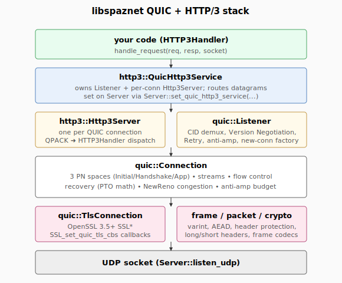

# QUIC + HTTP/3

libspaznet ships a from-scratch server-side QUIC v1 (RFC 9000/9001/9002)
+ HTTP/3 (RFC 9114) + QPACK (RFC 9204) stack. TLS 1.3 is driven by
OpenSSL 3.5+ via the `SSL_set_quic_tls_cbs` callback interface; the
rest of the transport, recovery, congestion, HTTP/3, and QPACK code is
in-tree with no other third-party dependencies.

This page is the user-facing walkthrough. For the security model, see
[`quic-security.md`](quic-security.md). For what's not implemented yet,
see [`api-status.md`](api-status.md).

## Layers



The pieces, top to bottom:

| Type | Header | Role |
|---|---|---|
| `HTTP3Handler` | `<libspaznet/handlers/http3_handler.hpp>` | Your code. `handle_request(req, resp, socket)`. |
| `http3::QuicHttp3Service` | `<libspaznet/http3/service.hpp>` | Owns the `Listener` + per-connection `Http3Server`. Drop-in for `Server::set_quic_http3_service`. |
| `http3::Http3Server` | `<libspaznet/http3/server.hpp>` | One per active QUIC connection. Speaks HTTP/3 framing, QPACK-decodes headers, dispatches to `HTTP3Handler`. |
| `quic::Listener` | `<libspaznet/quic/listener.hpp>` | UDP-side dispatcher. Demuxes datagrams by Destination Connection ID, creates new `quic::Connection`s on incoming Initials, emits Version Negotiation / Retry as configured. |
| `quic::Connection` | `<libspaznet/quic/connection.hpp>` | Per-peer state machine. Three PN spaces (Initial / Handshake / Application), streams, recovery, congestion. |
| `quic::TlsContext` / `quic::TlsConnection` | `<libspaznet/quic/tls.hpp>` | Thin wrappers over OpenSSL's `SSL_CTX` / `SSL*` configured for QUIC. |
| frame / packet / crypto | `<libspaznet/quic/{frame,packet,crypto,varint}.hpp>` | Wire-format codecs. You don't construct these directly. |

## Minimal server

```cpp
#include <libspaznet/server.hpp>
#include <libspaznet/handlers/http3_handler.hpp>
#include <libspaznet/quic/listener.hpp>
#include <libspaznet/quic/tls.hpp>
#include <libspaznet/http3/service.hpp>

class HelloH3 : public spaznet::HTTP3Handler {
public:
    spaznet::Task handle_request(
        const spaznet::HTTP3Request& req,
        spaznet::HTTP3Response& resp,
        spaznet::Socket&
    ) override {
        resp.status_code = 200;
        resp.body = {'H','e','l','l','o',',',' ','h','3','!'};
        co_return;
    }
};

int main() {
    using namespace spaznet;

    // 1. Build a TLS context. Server cert + key + ALPN = {"h3"}.
    quic::TlsServerConfig tls_cfg{
        /*cert_pem*/ load_pem("server.crt"),
        /*key_pem*/  load_pem("server.key"),
        /*alpns*/    {"h3"},
    };
    auto tls = quic::TlsContext::make_server(tls_cfg);

    // 2. Build the QuicHttp3Service.  This wires the Listener +
    //    per-conn Http3Server with your handler.
    quic::Listener::Config lcfg;
    lcfg.tls_ctx = tls;
    lcfg.server_tp.initial_max_data                 = 1 << 20;
    lcfg.server_tp.initial_max_stream_data_bidi_remote = 1 << 16;
    lcfg.server_tp.initial_max_streams_bidi         = 100;
    lcfg.server_tp.initial_max_streams_uni          = 100;
    // lcfg.require_retry = true;   // see quic-security.md

    auto service = std::make_unique<http3::QuicHttp3Service>(
        std::move(lcfg),
        std::make_unique<HelloH3>());

    // 3. Hand it to a Server and start a UDP listener.
    Server server(4);
    server.set_quic_http3_service(std::move(service));
    server.listen_udp(4433);
    server.run();
}
```

Three things to notice:

1. **No `set_http_handler` / `set_websocket_handler` is required.** The
   QUIC stack is wholly independent of HTTP/1.1 / WebSocket. You can
   mix them on the same `Server` instance (different ports), but
   you don't have to.
2. **`listen_udp`, not `listen_tcp`.** QUIC runs over UDP. The
   `Server` routes incoming datagrams to `QuicHttp3Service::handle_datagram`
   when one is registered.
3. **Transport parameters** are advertised to the peer at handshake
   time. Set the `initial_max_*` knobs to non-zero or the peer can't
   send any STREAM bytes.

## `Listener::Config` knobs

| Field | Default | Meaning |
|---|---|---|
| `tls_ctx` | (required) | Shared `TlsContext`. Built via `TlsContext::make_server(TlsServerConfig{cert, key, alpns})`. |
| `server_tp` | empty | Transport parameters advertised to clients. **Must set** at least `initial_max_streams_bidi` and one of `initial_max_data` / `initial_max_stream_data_bidi_remote` or no STREAM data will flow. |
| `server_cid_length` | 8 | Length of server-chosen Source Connection IDs (1..20). |
| `require_retry` | false | If true, every new client gets a Retry round-trip before connection state is allocated. Address-validates the peer (anti-DDoS-amp). See [quic-security.md](quic-security.md). |
| `random_seed` | 0 (auto) | Seed for SCID + Retry-token nonce generation. 0 = derive from `std::random_device` + `this` address. |

## Transport parameters worth setting

These are the ones that materially affect throughput / fairness:

```cpp
quic::TransportParameters tp;
tp.initial_max_data                 = 1 << 20;   // 1 MiB connection-level
tp.initial_max_stream_data_bidi_local  = 1 << 16; // 64 KiB local-initiated stream
tp.initial_max_stream_data_bidi_remote = 1 << 16; // 64 KiB peer-initiated stream
tp.initial_max_stream_data_uni      = 1 << 16;
tp.initial_max_streams_bidi         = 100;       // peer-initiated bidi streams
tp.initial_max_streams_uni          = 100;       // peer-initiated uni streams (control + QPACK)
tp.max_idle_timeout                 = 30'000;    // ms; 0 = no peer-imposed idle limit
tp.max_udp_payload_size             = 1452;      // typical path MTU
```

`original_destination_connection_id`, `initial_source_connection_id`,
and `retry_source_connection_id` are set automatically by the
`Connection` constructor based on the handshake state — you don't
need to fill them in yourself.

## End-to-end walkthrough

The handshake unfolds across three encryption levels:

```
client                                            server
  |                                                 |
  |   Initial (CRYPTO: ClientHello)  + 1200B pad   |
  |----------------------------------------------->|  Listener creates Connection
  |                                                 |  recv_bytes += 1200; budget = 3600
  |                                                 |  send ServerHello + Handshake
  |                                                 |  CRYPTO; ack-eliciting
  |                                                 |
  |   Initial (CRYPTO: ServerHello)  + Handshake   |
  |   (Cert, CertVerify, Finished) coalesced       |
  |<-----------------------------------------------|
  |                                                 |
  |   Initial ACK + Handshake (CRYPTO: Finished)   |
  |   + 1-RTT (STREAM 0: GET ...)                  |
  |----------------------------------------------->|  validates peer (Handshake decrypts)
  |                                                 |  anti-amp cap released
  |                                                 |  HTTP3Handler::handle_request runs
  |                                                 |
  |   1-RTT (STREAM 0: HEADERS, DATA, FIN)         |
  |<-----------------------------------------------|
```

The Listener owns the UDP socket. Every received datagram lands in
`QuicHttp3Service::handle_datagram`, which forwards to
`Listener::on_datagram`, which:

1. Parses just enough of the long-header to find the DCID.
2. Looks up an existing `Connection` keyed by that DCID (or by an
   alias for first-Initial retransmits).
3. If no connection exists and the packet is an Initial:
    - if `require_retry` is set and there's no token (or a bad token),
      emits a Retry packet and drops;
    - otherwise builds a new `Connection`, hands it the datagram, and
      registers it under the server's chosen SCID.
4. Otherwise dispatches `Connection::on_datagram(...)`.

Once the handshake completes the `Connection` flips to `Established`,
and HTTP/3 starts speaking on streams 0, 4, 8, … (client-initiated
bidi) plus 2, 6, 10, … (server-initiated uni, used for HTTP/3 control
and QPACK encoder/decoder streams).

## Generating a test cert

For development / loopback testing — never use a self-signed cert in
production:

```bash
openssl req -x509 -newkey ec -pkeyopt ec_paramgen_curve:P-256 \
    -keyout server.key -out server.crt \
    -days 30 -nodes \
    -subj '/CN=localhost'
```

Or generate one in-process using the OpenSSL `EVP_PKEY` API — see
`tests/unit/test_quic_listener.cpp::make_self_signed` for an example.

## Talking to the server with `curl`

`curl` needs to be built with `--with-quiche`, `--with-ngtcp2`, or
`--with-openssl-quic` for HTTP/3 support:

```
curl --http3-only -k https://127.0.0.1:4433/
```

If `curl -V | grep HTTP3` is silent, your local curl doesn't have h3.
On macOS, `brew install curl --HEAD --with-openssl-quic` builds one
manually. On Ubuntu, `apt install curl` does not yet ship h3 on stock
distros; build from source or use `nghttp -nv` for a self-test.

## What you can't do yet

These are the rough edges. See [`api-status.md`](api-status.md) for
the full list.

- **No client mode.** `quic::Connection::Role` has only `Server`.
- **No key update** (RFC 9001 §6). Long-lived 1-RTT connections will
  eventually exceed the AES-128-GCM 2²³ packet limit and lose protocol
  compliance.
- **No PTO retransmission.** Recovery does the math but
  `Connection::on_timer` doesn't act on it. **Loss recovery does
  not work.** Loopback tests pass because there's no loss; on a real
  network, expect protocol stalls.
- **No connection migration.** The Listener happily updates the
  per-connection peer address on every datagram, which technically
  violates RFC 9000 §9 (server MUST validate the new path via
  PATH_CHALLENGE / PATH_RESPONSE before sending non-probing data
  there).
- **No CONNECTION_CLOSE emission on protocol errors.** We parse
  incoming CONNECTION_CLOSE; we don't send one when our own parser
  hits a protocol error — we just `Closing` silently.
- **No 0-RTT.**
- **HTTP/3 server push** is not implemented.
- **QPACK dynamic table** is not implemented. The server advertises
  `SETTINGS_QPACK_MAX_TABLE_CAPACITY = 0` and rejects non-zero
  Required-Insert-Count fields.

## Related

- [`api-status.md`](api-status.md) — full feature matrix
- [`quic-security.md`](quic-security.md) — Retry token format,
  anti-amp budget, what's resistant to what
- [`mutex-vs-atomics.md`](mutex-vs-atomics.md) — the listener
  inherits the same lock posture as the rest of the library
