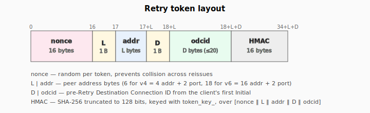

# QUIC security model

What's resistant to what, and where the holes are. Read this before
exposing the QUIC stack to an untrusted network.

For protocol-feature status see [`api-status.md`](api-status.md). For
the user-facing API see [`quic-http3.md`](quic-http3.md).

## In-scope today

### Address validation via Retry (RFC 9000 §8.1.3)

When `Listener::Config::require_retry` is enabled, the very first
Initial from each peer is rejected with a Retry packet carrying a
peer-bound token. The client must echo that token on its second
Initial; we verify the token before allocating any connection state.

This blocks the DDoS-amplification vector where an attacker spoofs a
victim's source address and asks the server to send (up to 3×) bytes
to it. With Retry on, an attacker has to receive the Retry packet at
the spoofed address to learn the token — which they can't.

#### Token format



```
nonce (16) || L (1 byte) || addr (L bytes) ||
D (1 byte) || odcid (D bytes) || HMAC-SHA256-trunc128 (16 bytes)
```

- **nonce**: 16 random bytes from the listener's PRNG, so two tokens
  issued back-to-back to the same client differ.
- **L | addr**: serialized peer address. For IPv4 that's 4 address
  bytes + 2 port bytes (network order) = 6. For IPv6 it's
  16 + 2 = 18. Other families return empty (token build/verify fail).
- **D | odcid**: the Destination Connection ID from the client's
  pre-Retry Initial. We need to remember it because the OD-CID
  ends up in the `original_destination_connection_id` transport
  parameter sent to the client after the handshake.
- **HMAC**: SHA-256 truncated to 128 bits, keyed by the per-listener
  `token_key_` (derived from `random_seed`), over everything
  preceding the MAC.

Verification is a constant-time `memcmp` of the MAC followed by an
address-match check.

#### Replay resistance

A token is bound to (peer_addr, odcid) at the time the listener
minted it. If an attacker captures a victim's Retry token:

- Replay from a *different* source address fails (address-match check).
- Replay from the same source address succeeds — but the attacker
  already controls that address, so they could have completed the
  handshake themselves anyway.

There's **no token expiry**. A captured-then-replayed token from the
same address keeps working until the listener restarts (the per-process
`token_key_` regenerates). For long-running servers, periodically
rotating `Listener::Config::random_seed` provides expiry; we don't
do that automatically.

#### Token-key persistence

`token_key_` is derived once at `Listener` construction from
`Config::random_seed` (which itself defaults to
`random_device() ^ reinterpret_cast<uintptr_t>(this)`). Tokens are
not portable across listener instances — restart invalidates them.

### Anti-amplification budget (RFC 9000 §8.1.2)

Even without Retry, every `quic::Connection` enforces the 3×
amplification cap: until the peer's address is validated, total
outbound bytes ≤ 3 × total received bytes.

The cap is released when either:

- A Handshake-protected packet from the peer successfully decrypts.
  That proves the peer received our Initial response (which used
  keys derived from a CID only the legitimate peer knows), so it
  owns the source address. Automatic; happens in
  `Connection::process_long_packet`.
- The Listener verified a Retry token and called
  `Connection::mark_peer_address_validated()` at construction.

`build_and_send` bails early when `sent + 1500 > 3 × recv` while
still unvalidated. The 1500-byte slop is one full-MTU datagram of
headroom — strict equality would risk emitting exactly 3× and tripping
the peer's own anti-amp check; the slop is on the right side of the
cap because we estimate worst-case datagram size *before* building.

### Header / payload protection

Per RFC 9001:

- **AEAD**: AES-128-GCM (default), AES-256-GCM, or ChaCha20-Poly1305,
  negotiated via TLS. Implemented in `quic::CipherCtx` with cached
  `EVP_CIPHER_CTX`s per encryption level — only the IV resets per
  packet, never the key.
- **Header protection**: AES-128-ECB mask (AES-GCM ciphers) or
  ChaCha20 mask (ChaCha20-Poly1305), applied per packet over the
  packet-number sample.
- **In-place decrypt**: incoming packets are decrypted in their
  receive buffer; we never carry both ciphertext and plaintext copies
  around.

### Constant-time comparison

`validate_retry_token` does a fixed-iteration XOR-then-OR over the
16-byte MAC, not `memcmp`, so token-validation time is independent
of how many leading bytes the attacker got right. Same posture for
the integrity tag check on incoming Retry packets (not normally
relevant on a server, since servers don't receive Retry packets, but
the code path exists).

### Transport-parameter authentication

The TLS 1.3 handshake carries our transport parameters as a TLS
extension (codepoint 0x39). They're authenticated as part of the
ServerHello → Certificate → CertificateVerify → Finished chain — a
MitM can't change them without invalidating the Finished MAC.

That includes `original_destination_connection_id` and
`retry_source_connection_id`, which is what closes the
Retry-injection vector: if an attacker substitutes a different Retry
on the wire, the client's view of `retry_source_connection_id`
disagrees with what we tell it via TLS, and the client aborts.

### Frame parser hardening (partial)

The frame, packet, and varint parsers reject:

- Oversized varints (the 2-bit length prefix is checked).
- Truncated frames (length-field checks before payload read).
- Reserved frame types (variant rejects unknown discriminators).
- Out-of-bounds offsets (stream offsets that would overflow uint64).
- Packets shorter than the minimum framed Initial (1200 bytes per
  RFC 9000 §14.1) — handled at Listener level.

Every parser surface has a libFuzzer harness under
`example/quic-http3/fuzz/` (and the shared
`spaznet::codec::huffman_decode` under
`example/quic-http3/fuzz/fuzz_huffman_decode.cpp`).  Enable with
`-DSPAZNET_BUILD_FUZZ=ON -DCMAKE_CXX_COMPILER=clang++`; the
harnesses build with `-fsanitize=fuzzer,address,undefined` and run
self-driven.  Five-second baseline pass on meep (clang 18) finds
zero crashers across all of `parse_frame`, `parse_long_header`,
`decode_transport_params`, `VarInt::decode`, `qpack_decode`,
`parse_h3_frame`, and `huffman_decode`.

## Not in scope today

### Key update (RFC 9001 §6)

Long-lived 1-RTT connections have AEAD usage limits — 2²³ packets
at AES-128-GCM. Without key update, a chatty connection that runs
for hours violates RFC 9001 §6.6 (`AEAD_LIMIT_REACHED`). We don't
emit a `KEY_PHASE` bit toggle; if the peer toggles theirs, we drop
their packet.

**Mitigation today**: limit connection lifetime to <8M packets at
peer's send rate. For typical request/response workloads this is
not a near-term issue, but a sustained 1-Gbps connection at 1200-byte
datagrams hits the limit in ~80 seconds.

### Connection migration (RFC 9000 §9) — limited

`Listener::on_datagram` freezes `last_peer` once
`Connection::handshake_complete()` returns true. From the moment the
handshake finishes, every outbound datagram for that connection is
routed to the address the legitimate peer used to complete the
handshake; subsequent datagrams from any other address are still
delivered to the engine for processing, but they cannot redirect our
response traffic. This closes the off-path-injection redirection
hole.

In-bound `PATH_CHALLENGE` is honored: the engine echoes a
`PATH_RESPONSE` carrying the same 8-byte data in a 1-RTT packet on
the validated path, so peers using `PATH_CHALLENGE` for liveness or
PMTU probes continue to work.

We do **not** initiate path validation for candidate paths
(`PATH_CHALLENGE` from us to a new peer address), and we do not
migrate the validated path even after a successful round-trip on a
new one. A legitimate peer whose NAT rebinds mid-connection (e.g. a
mobile client changing networks) will see its responses keep flowing
to the old address until the idle timeout closes the connection;
that client must re-handshake.

**Tests**: `QuicConnection.RespondsToPathChallenge`,
`QuicListener.FreezesPathPostHandshake`.

### 0-RTT

Not implemented. There's no 0-RTT replay vulnerability because there's
nothing to replay.

### PTO retransmission

`Recovery` computes the math; `Connection::on_timer` does not consult
it. Dropped packets stay dropped. This isn't a *security* issue per
se — it's a reliability issue — but it interacts: a peer that doesn't
get our Initial response keeps retrying, and on each retry we count
their bytes toward the anti-amp budget. We never get above 3× of
their resent Initials. Either side eventually times out.

### Token rotation / expiry

As noted under Retry, tokens don't expire. There's no rotation
schedule for `token_key_`. A long-lived listener accumulates ever
more valid (peer_addr, odcid) pairs that an attacker who captured one
can replay forever from the same source.

### Fuzz coverage

Fuzz harnesses now exist (see above).  CI doesn't run them on every
PR yet; a periodic longer-running campaign would catch deeper bugs
than the 5-second baseline.  Tracked in
[TODO.md](../TODO.md).

### qlog tracing

Not implemented. Without it, debugging an interop failure means
recompiling with stderr printfs.

## Configuration recommendations

For a server reachable from the public internet:

```cpp
quic::Listener::Config cfg;
cfg.tls_ctx = tls;                              // production cert, real chain
cfg.server_tp.initial_max_data            = 1 << 20;
cfg.server_tp.initial_max_streams_bidi    = 100;
cfg.server_tp.max_idle_timeout            = 30'000;  // 30 s
cfg.require_retry  = true;                      // mandatory; mitigates amplification
cfg.server_cid_length = 8;                      // default; 16 if you need more bits of entropy
cfg.random_seed     = 0;                        // 0 => OS random_device + this address
```

For a loopback or trusted-LAN service:

```cpp
cfg.require_retry  = false;                     // saves an RTT per new connection
```

Restart the server periodically to rotate `token_key_`. If you can't,
plumb a token-key-rotation timer into your application — it's not
provided by the library.

## Related

- [`quic-http3.md`](quic-http3.md) — user-facing API walkthrough
- [`api-status.md`](api-status.md) — what's implemented vs not
- [TODO.md](../TODO.md) — pending QUIC follow-ups (fuzzing, PTO,
  key update, migration)
