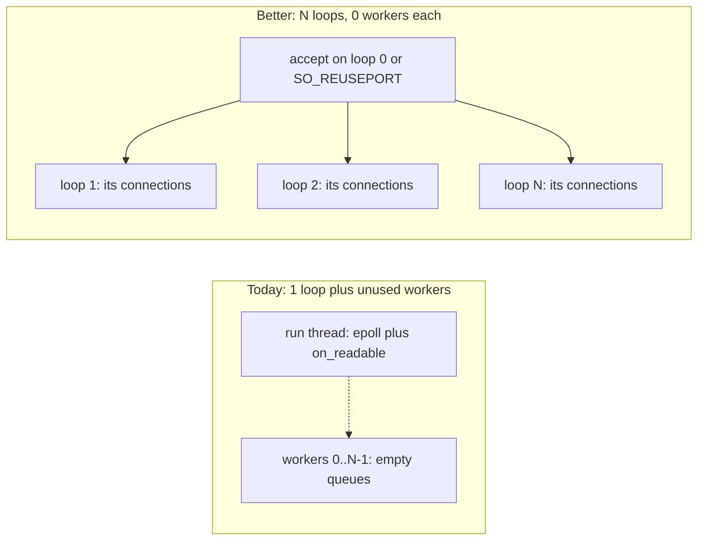

# Reactor threading: why `Server(N)` does not scale, and what would

Snapshot 2026-08-12. This is an analysis of the current reactor
execution model and the threading change that would actually raise
throughput. Nothing described under "Recommended change" is
implemented yet.

For how `Server(N)` works *today* (coroutine workers, one loop), see
[`threading.md`](threading.md). For the affinity primitive the reactor
dispatchers already rely on, see
[`concurrency-and-coroutines.md`](concurrency-and-coroutines.md)'s
"Reactor Threading Model". Numbers below are from
[`thread_mode_report.md`](../thread_mode_report.md) on meep (Linux
x86_64, 32 cores).

## The current model is correct for safety and wrong for throughput

`Server(N)` still means **one event loop**. `IOContext::run()` is the
only thread that calls `PlatformIO::wait()` and
`on_readable()`/`on_writable()`. The `N` workers only drain
`thread_queues_` (coroutine resumes) and `callback_queues_`
(`post()`). Reactor connections never use either.

That is why the reactor rows in `thread_mode_report.md` are flat:
`Server(0)` and `Server(512)` do the same work on one core. Coroutines
scale on large bodies because the frame can migrate and the
memcpy/syscall volume spreads across workers:

| Case | Best coroutine rps | Reactor rps (any N) | Gap |
|---|---:|---:|---|
| 0 B / 0 B | ~40k | ~32k | small |
| 64 KiB / 64 KiB | ~74k @ 16 | ~13k | ~6× |
| 64 KiB / 256 KiB | ~50k @ 16 | ~3.9k | ~13× |

The missing piece is not "smarter workers on the existing loop." It is
**N independent loops, each owning its own connections.**

Do **not** make workers invoke `on_readable()` on shared connections.
That is the model the HTTP/2 reactor dispatcher just escaped (its
former `recursive_mutex`). Connection state has to stay
single-threaded; the way to use more cores is more loops, not more
threads on one loop.

A handful of low reactor outliers at `threads=16` in that same report
are a different phenomenon: the bench opens a new TCP connection per
request, so accumulated loopback churn can stall the single I/O
thread. Because that thread is the only one that can make reactor
progress, a stall shows up as near-zero rps with `errors=0` and
normal-looking percentiles (the timer starts after `connect()`). It is
not evidence that 16 is a special thread count. See the caveat in
`thread_mode_report.md`.

## Options



### 1. Stop spawning unused workers (small)

In a reactor-only `Server(N)`, those threads park on a CV forever.
Skipping them saves RAM and context switches and makes `N` stop being
a lie. It does not raise rps.

### 2. Offload handler CPU, keep I/O on the loop (narrow)

`handle_request` runs on the I/O thread today. A slow handler could
`post()` the work and complete via `post_to_io_thread()`. Useful for
JSON, crypto, or a database call. Useless for `bench_thread_modes`,
where `BenchHandler` is trivial and the large-body cost is
`recv`/`send`/memcpy inside `BufferedConnection` — still on the I/O
thread.

### 3. N event loops with connection pinning (the real fix)

Each loop is today's `IOContext` with `num_threads_ = 0`: its own
`PlatformIO`, fd table, timers, reap list, and `post_to_io_thread`
queue. A connection is created on one loop and never moves.
Dispatchers do not change; they already assume "one IO thread per
`IOContext`."

Two ways to get new sockets onto those loops:

| | Accept-and-shard | `SO_REUSEPORT` |
|---|---|---|
| How | One listen fd; accept thread round-robins client fds onto loops | Each loop binds the same port; kernel distributes accepts |
| Portability | All backends (epoll/kqueue/poll/IOCP) | Linux/BSD; Windows is a different knob |
| Accept scaling | Still one `accept()` loop — connect-storm stays a known limit | Accepts scale with loops |
| Complexity | Fd handoff: never register the client fd on the accept loop | Extra listen sockets, `SO_REUSEPORT` plus fallback |
| Cross-connection send | Already fine: `Connection::send()` posts to **that** connection's `IOContext` | Same |

**Recommendation:** accept-and-shard first. It matches the current
`Server(port)` API, stays portable, and is enough to close the
large-body gap. Add `SO_REUSEPORT` later if connect-storm / tiny-RPC
accept rate becomes the next ceiling.

### 4. N `Server` processes (already documented)

Works today via separate ports or app-level `SO_REUSEPORT`. Fine as an
ops workaround; it is not a library threading model. See
[`threading.md`](threading.md)'s "Pinning a connection to a thread."

## What `Server(N)` should mean

Today `N` means coroutine workers. For reactors that is the wrong
axis.

A clean split:

```cpp
struct ServerConfig {
    std::size_t loops = 1;            // independent IOContext instances
    std::size_t workers_per_loop = 0; // coroutine-only; ignore for reactor
};
```

- Reactor-only: `loops = N`, `workers_per_loop = 0`
- Coroutine-only: `loops = 1`, `workers_per_loop = N` (current behavior)
- Mixed process: possible but not the first milestone

`Server(N)` can keep its current meaning for coroutines and grow an
overload / config object so reactor callers are not silently ignored.

## What has to change in the library

Almost none of it is in the protocol dispatchers.

- **`Server` owns `vector<unique_ptr<IOContext>>`**, not one.
  `run()` starts `loops-1` threads each calling
  `io_contexts_[i]->run()`, then blocks in
  `io_contexts_[0]->run()`.
- **`ListenHandler` / `accept_ready`** pick a target loop
  (round-robin or least `active_connections`), call
  `connection_factory_(fd, *target_ctx, on_closed)`, and register
  the handler on **that** context. The listen fd stays on loop 0.
- **`ConnectionFactory` already takes `IOContext&`** — factories
  need no signature change.
- **`post_to_io_thread` stays as-is**, per context. WebSocket
  broadcast already goes through the target connection's context;
  that becomes real multi-core rather than a no-op hop on one
  thread.
- **`Server::stop()`** must stop every loop, then join.
- **UDP / QUIC** do not fall out for free. One datagram socket
  cannot be sharded by connection the way TCP fds can. Leave them
  on loop 0 until a later `SO_REUSEPORT` / CID-hash design. The
  HTTP/WS/H2 gap is the one the numbers show.
- **Windows IOCP** can wait from many threads on one port; still
  prefer N loops over "workers call `on_readable` on shared
  state," so the affinity invariant stays the same on every
  backend.

## What not to do

- Shared-connection I/O on many threads plus a mutex (regresses
  HTTP/2).
- One epoll fd, many `epoll_wait` callers (`EPOLLONESHOT` /
  `EPOLLEXCLUSIVE` thundering-herd maze, still needs pinning or
  locks).
- Reinterpreting `Server(N)` as loops without a config split —
  coroutine and reactor want opposite shapes.

## Expected payoff

After accept-and-shard, reactor large-body rows should start tracking
coroutine rows as `loops` rises, instead of sitting on the `Server(0)`
line. Tiny-body / connect-per-request will move less until keep-alive
and/or `SO_REUSEPORT` address accept-path contention — that is a
different bottleneck than "reactor can't use extra cores."

## Suggested first milestone

If this is built: `Server` owns N `IOContext`s, TCP accept shards onto
them, `bench_thread_modes` reports reactor rps vs `loops`, UDP/QUIC
stay on loop 0, no dispatcher rewrites.

## Related

- [`threading.md`](threading.md) — current `Server(N)` model and
  tuning
- [`concurrency-and-coroutines.md`](concurrency-and-coroutines.md) —
  why reactor state cannot migrate, and `post_to_io_thread`
- [`coro-free-build.md`](coro-free-build.md) — reactor authoring
  rules
- [`performance.md`](performance.md) — headline numbers
- [`../thread_mode_report.md`](../thread_mode_report.md) — coroutine
  vs reactor sweep this analysis is based on
