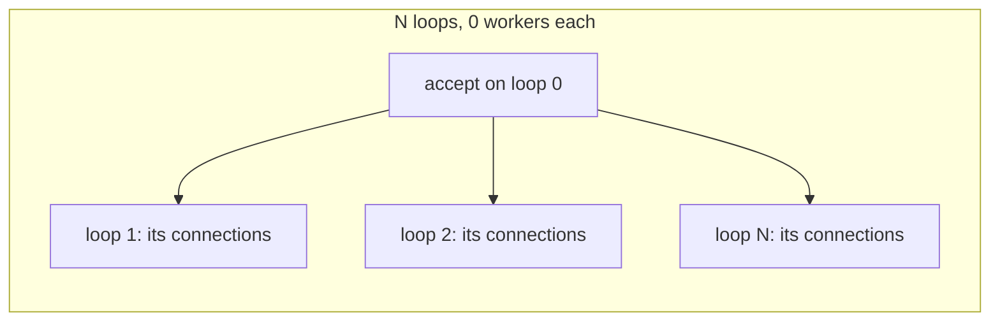

# Reactor threading: N independent loops (accept-and-shard)

Snapshot 2026-08-13. The multi-loop accept-and-shard design described
here is **implemented**. Historical numbers that motivated the change
are retained below for context.

For how `Server(N)` works for coroutines (workers on one loop), see
[`threading.md`](threading.md). For the affinity primitive the reactor
dispatchers rely on, see
[`concurrency-and-coroutines.md`](concurrency-and-coroutines.md)'s
"Reactor Threading Model". Pre-change numbers below are from
[`thread_mode_report.md`](../thread_mode_report.md) on meep (Linux
x86_64, 32 cores).

## Why the old model could not scale

Before this change, `Server(N)` still meant **one event loop**.
`IOContext::run()` was the only thread that called `PlatformIO::wait()`
and `on_readable()`/`on_writable()`. The `N` workers only drained
`thread_queues_` (coroutine resumes) and `callback_queues_` (`post()`).
Reactor connections never used either.

That is why the reactor rows in the pre-change
`thread_mode_report.md` were flat: `Server(0)` and `Server(512)` did
the same work on one core. Coroutines scaled on large bodies because
the frame can migrate and the memcpy/syscall volume spreads across
workers:

| Case | Best coroutine rps | Reactor rps (any N) | Gap |
|---|---:|---:|---|
| 0 B / 0 B | ~40k | ~32k | small |
| 64 KiB / 64 KiB | ~74k @ 16 | ~13k | ~6× |
| 64 KiB / 256 KiB | ~50k @ 16 | ~3.9k | ~13× |

Do **not** make workers invoke `on_readable()` on shared connections.
That is the model the HTTP/2 reactor dispatcher escaped (its former
`recursive_mutex`). Connection state has to stay single-threaded; the
way to use more cores is more loops, not more threads on one loop.

## What shipped: N loops with accept-and-shard




Each loop is an `IOContext` with `workers_per_loop = 0`: its own
`PlatformIO`, fd table, timers, reap list, and `post_to_io_thread`
queue. A connection is created on one loop and never moves.
Dispatchers did not need signature changes; they already assume "one
IO thread per `IOContext`."

Accept-and-shard (what is implemented):

- One listen fd, registered on **loop 0**
- `accept_ready` round-robins each client fd onto a target loop
- `reactor_connection_factory_(fd, *target_ctx, on_closed)` registers the
  handler on **that** context — the client fd is never registered on
  the accept loop
- `Server::run()` starts loops `1..N-1` on their own threads, then
  blocks in `io_contexts_[0]->run()`
- `Server::stop()` posts `IoHandler::shutdown()` to each owning loop
  via `post_to_io_thread`, then stops every context and joins

UDP / QUIC stay on loop 0. One datagram socket cannot be sharded by
connection the way TCP fds can; a later `SO_REUSEPORT` / CID-hash
design can address that.

`SO_REUSEPORT` (not yet): each loop binds the same port; kernel
distributes accepts. Useful if connect-storm / tiny-RPC accept rate
becomes the next ceiling after accept-and-shard.

## `ServerConfig` — what `N` means now

```cpp
struct ServerConfig {
    std::size_t loops = 1;            // independent IOContext instances
    std::size_t workers_per_loop = 0; // coroutine-only; ignore for reactor
};
```

| Shape | Construction | Meaning |
|---|---|---|
| Coroutine-only | `Server(N)` or `ServerConfig{1, N}` | 1 loop, N workers (historical) |
| Reactor-only | `Server(ServerConfig{N, 0})` | N loops, 0 workers, accept-and-shard |
| Mixed | `ServerConfig{L, W}` with both > 0 | Allowed; reactor TCP shards across L loops, coroutine connections stay on loop 0 |

`Server(N)` deliberately keeps its coroutine meaning so existing callers
are not silently reinterpreted. Reactor callers that want scaling must
pass `ServerConfig`.

## What not to do

- Shared-connection I/O on many threads plus a mutex (regresses
  HTTP/2).
- One epoll fd, many `epoll_wait` callers (`EPOLLONESHOT` /
  `EPOLLEXCLUSIVE` thundering-herd maze, still needs pinning or
  locks).
- Reinterpreting `Server(N)` as loops without a config split —
  coroutine and reactor want opposite shapes.

## Measured payoff (2026-08-13, meep, 32 cores)

From [`../thread_mode_report.md`](../thread_mode_report.md) after
accept-and-shard. Reactor **threads** column = `loops`.

| Case | Reactor @ loops=1 | Reactor best | Coroutine best |
|---|---:|---:|---:|
| 64 KiB / 64 KiB | ~13k rps | ~67k @ 32 | ~90k @ 8 |
| 64 KiB / 256 KiB | ~4.0k rps | ~45k @ 16 | ~58k @ 16 |

Large-body reactor rows now climb with `loops` instead of sitting on
the old flat `Server(0)` line. Tiny-body / connect-per-request still
shows occasional near-zero outliers (accept-path / TIME_WAIT on the
single listen fd) — a different bottleneck than "reactor can't use
extra cores." `SO_REUSEPORT` remains the follow-up if that becomes the
ceiling.

`bench_thread_modes` reports reactor rps against `loops` (the
**threads** column for the reactor dispatcher) and coroutine rps
against workers.

## Related

- [`threading.md`](threading.md) — `Server(N)` / `ServerConfig` tuning
- [`concurrency-and-coroutines.md`](concurrency-and-coroutines.md) —
  why reactor state cannot migrate, and `post_to_io_thread`
- [`coro-free-build.md`](coro-free-build.md) — reactor authoring
  rules
- [`performance.md`](performance.md) — headline numbers
- [`../thread_mode_report.md`](../thread_mode_report.md) — coroutine
  vs reactor sweep this analysis was based on
