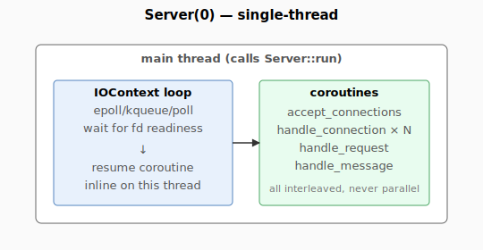
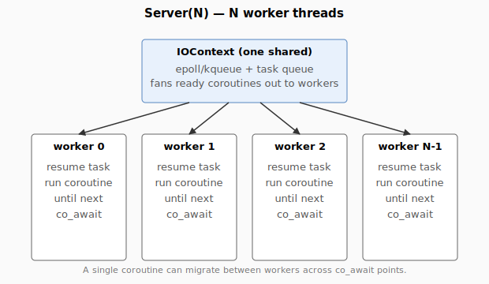

# Threading model and tuning

`Server` takes a single integer at construction:

```cpp
spaznet::Server server(N);
```

`N == 0` is **single-thread mode**. `N >= 1` spawns N IO worker threads.
This page covers what that means in practice and how to pick a value.

## Single-thread mode (`Server(0)`)



The thread that calls `Server::run()` owns the IOContext loop *and*
runs every coroutine. Coroutines never migrate; resume is always
inline on the calling thread.

Properties:

- No cross-thread synchronization on the hot path. Reads and writes to
  any data structure your handler owns are race-free.
- Latency is excellent (no scheduling delay).
- Throughput is bounded by what one core can do. Past that point you
  need multi-thread mode or a second server process.

Use single-thread mode when:

- The workload is latency-sensitive and modest in total throughput.
- You'd otherwise need locks in your handler.
- The connect-storm or short-RPC workload (see below) makes
  multi-thread mode regress.

## Multi-thread mode (`Server(N)`)



One shared `IOContext` runs the event loop (epoll/kqueue). When a
coroutine becomes runnable, IOContext picks an idle worker and hands it
the resume. Workers each pop from the shared task queue and run the
coroutine until its next `co_await`.

Properties:

- A single connection's coroutines can migrate between workers across
  `co_await` points. The `Socket&` your handler holds is stable but
  the **thread** running your handler can change after every suspend.
- Connection-scoped data must be held in coroutine locals (which the
  coroutine frame preserves) or in shared structures protected by
  appropriate synchronization.
- The library itself uses 4 mutexes + 1 atomic-flag spinlock; everything
  else on the hot path is `std::atomic`. See [`mutex-vs-atomics.md`](mutex-vs-atomics.md).

## Picking `N`

There's no universal answer, but a few patterns hold across the
workloads in `netbench`:

### Best `N` by workload (meep, 32-core Linux, snapshot 2026-05-30)

| Workload | Best `N` | Notes |
|---|---:|---|
| HTTP/1.1 keep-alive, tiny body (256 B) | 4 | 573K rps; rises slightly to 8 then plateaus |
| HTTP/1.1 keep-alive, 4 KiB body | 16 | 401K rps; the kernel TCP loopback ceiling starts limiting at 8 |
| HTTP/1.1 keep-alive, 64 KiB body | 16 | 6.7 GiB/s; saturates the loopback path |
| WebSocket echo, 64 B | 4 | 552K rps; small frames don't gain past 4 |
| WebSocket echo, 8 KiB | 4–8 | 341K rps |
| WebSocket echo, 64 KiB | 8 | 5.4 GiB/s |
| Connect storm | **0** (single-thread) | Single-thread is fastest. Multi-thread regresses sharply under SYN-queue overflow. |

### Best `N` by workload (Mac M1, 14-core, snapshot 2026-05-30)

macOS loopback is much harsher on multi-stream (the kernel serializes
single-receiver loopback), so the numbers differ:

| Workload | Best `N` | Notes |
|---|---:|---|
| HTTP/1.1 keep-alive, 256 B | 0 (single-thread) | Multi-thread adds overhead without throughput gain |
| HTTP/1.1 keep-alive, 64 KiB | 4 | 3.2 GiB/s; modest gain from threading |
| WebSocket echo, 64 B | 0 | 105K rps; same throughput as 4-thread with 4× the CPU |
| WebSocket echo, 64 KiB | 4 | 3.3 GiB/s |

## Tuning rules of thumb

- **If your hot path holds a lock**, single-thread mode is faster than
  every multi-thread tuning. Locks erase the benefit threading gives.
- **If your connections are short**, fewer threads. The connect path
  is bounded by the listen-socket backlog and accept-loop contention,
  not by handler CPU; adding workers just adds scheduling overhead.
- **If your connections are persistent and CPU-bound (large bodies,
  TLS, compression)**, scale `N` up to nproc/2. Bench shows diminishing
  returns past nproc/2 and explicit regression past nproc on small
  payloads.
- **Don't pick N == nproc.** Worker threads compete with kernel-side
  TCP processing on the same cores. nproc/2 to nproc-1 is the
  practical sweet spot.

## What threads coroutines actually run on

```
Server::run()  → IOContext::run()         [calling thread]
worker 0..N-1  → IOContext::worker_thread [N spawned threads]
```

Every coroutine starts on the thread that's about to dispatch it
(either the calling thread or a worker). At each `co_await`, the
coroutine suspends; when the awaited event fires, the IOContext picks
an available worker to resume on. That worker might be the same one,
or a different one — there's no thread affinity.

The only thread-affinity guarantee is that **between any two
`co_await` points, the coroutine runs on a single thread**. So
`thread_local` data is consistent within a synchronous chunk of work.

## Pinning a connection to a thread

Not supported directly. The IOContext's task queue is shared across
all workers; there's no per-connection thread routing. If you need
strict CPU-affinity (e.g. for a connection-per-NUMA-node setup), run
multiple `Server` instances on different ports and pin each via the
OS (`taskset`, `pthread_setaffinity_np`, `numactl`).

## Stop / drain semantics

`Server::stop()` is safe to call from any thread (including from
within a handler — though you'd want to schedule it to avoid stopping
mid-coroutine). It:

1. Sets a stop flag so accept loops exit.
2. Closes all listening sockets.
3. Shuts down active client sockets so suspended `recv`/`send` returns.
4. Waits up to 1 second for in-flight coroutines to drain.
5. Stops the IOContext loop. Workers join when `Server::run()` returns.

Coroutines still suspended after the 1-second drain leak — the design
trade-off is "stop deterministically vs guarantee zero leaks". If you
need stricter guarantees, drain your application-level state before
calling `stop`.

## Known multi-thread regressions

- **Connect storm**: see [bench_connect_storm](../../../netbench/src/bench_connect_storm.cpp).
  At 4+ threads on a single listen socket, the SYN queue overflows
  faster than `accept()` can drain it, and per-connection latency
  blows up. Single-thread mode is the right answer for this workload.

- **Tiny WebSocket frames**: at 64 B / 4 threads, libspaznet uses
  ~13 µs of CPU per echoed message vs ~5 µs on libzenomt. The recent
  stash-buffered recv (commit eb3ea04) closed most of the gap on
  single-thread; the multi-thread case still has the inherent cost
  of scheduling each frame's continuation through the worker queue.
  For tiny-frame workloads, prefer `Server(0)`.

## Related

- [concurrency-and-coroutines.md](concurrency-and-coroutines.md) —
  what a `Task` actually is and how `co_await` works
- [mutex-vs-atomics.md](mutex-vs-atomics.md) — what's locked vs
  atomic in the library itself
- [performance.md](performance.md) — broader benchmark numbers
