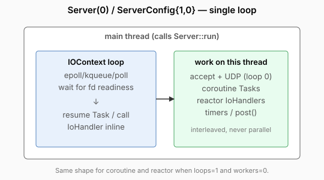
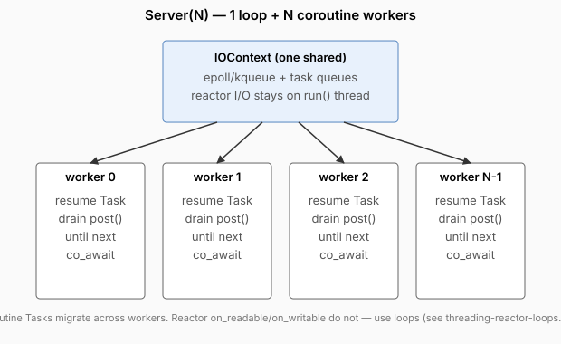

# Threading model and tuning

`Server` exposes two axes of parallelism via `ServerConfig`:

```cpp
struct ServerConfig {
    std::size_t loops = 1;            // independent IOContext instances
    std::size_t workers_per_loop = 0; // coroutine worker threads per loop
};

spaznet::Server server(N);                              // == {loops=1, workers_per_loop=N}
spaznet::Server reactor(ServerConfig{.loops = N});      // N loops, accept-and-shard
```

- `Server(0)` / `ServerConfig{1, 0}` — **single loop**, no workers
- `Server(N)` / `ServerConfig{1, N}` — **one loop + N coroutine workers**
- `Server(ServerConfig{.loops = N})` — **N loops** for reactor TCP I/O

This page covers what that means in practice and how to pick a value.
For the reactor multi-loop design see [`reactor-threading.md`](reactor-threading.md).

## Single-loop mode (`Server(0)`)



The thread that calls `Server::run()` owns the one `IOContext` loop and
runs every coroutine resume and every reactor `IoHandler` callback
inline. Nothing migrates; there are no worker threads.

Properties:

- No cross-thread synchronization on the hot path. Reads and writes to
  any data structure your handler owns are race-free.
- Latency is excellent (no scheduling delay).
- Throughput is bounded by what one core can do. Past that point
  coroutines want workers (`Server(N)`); reactors want loops
  (`ServerConfig{.loops = N}`).

Use single-loop mode when:

- The workload is latency-sensitive and modest in total throughput.
- You'd otherwise need locks in your handler.
- The connect-storm or short-RPC workload (see below) makes
  multi-thread / multi-loop mode regress.

## Coroutine multi-thread mode (`Server(N)`)



One shared `IOContext` runs the event loop (epoll/kqueue). When a
coroutine becomes runnable, IOContext picks an idle worker and hands it
the resume. Workers each pop from the shared task queue and run the
coroutine until its next `co_await`. Reactor `on_readable` /
`on_writable` still run only on the `run()` thread of that one loop.

Properties:

- A single connection's coroutines can migrate between workers across
  `co_await` points. The `Socket&` your handler holds is stable but
  the **thread** running your handler can change after every suspend.
- Connection-scoped data must be held in coroutine locals (which the
  coroutine frame preserves) or in shared structures protected by
  appropriate synchronization.
- The library itself uses 4 mutexes + 1 atomic-flag spinlock; everything
  else on the hot path is `std::atomic`. See [`mutex-vs-atomics.md`](mutex-vs-atomics.md).

## Picking `N`

There's no universal answer, but a few patterns hold across the
workloads in `netbench`:

### Best `N` by workload (meep, 32-core Linux, snapshot 2026-05-30)

| Workload | Best `N` | Notes |
|---|---:|---|
| HTTP/1.1 keep-alive, tiny body (256 B) | 4 | 573K rps; rises slightly to 8 then plateaus |
| HTTP/1.1 keep-alive, 4 KiB body | 16 | 401K rps; the kernel TCP loopback ceiling starts limiting at 8 |
| HTTP/1.1 keep-alive, 64 KiB body | 16 | 6.7 GiB/s; saturates the loopback path |
| WebSocket echo, 64 B | 4 | 552K rps; small frames don't gain past 4 |
| WebSocket echo, 8 KiB | 4–8 | 341K rps |
| WebSocket echo, 64 KiB | 8 | 5.4 GiB/s |
| Connect storm | **0** (single-thread) | Single-thread is fastest. Multi-thread regresses sharply under SYN-queue overflow. |

### Best `N` by workload (Mac M1, 14-core, snapshot 2026-05-30)

macOS loopback is much harsher on multi-stream (the kernel serializes
single-receiver loopback), so the numbers differ:

| Workload | Best `N` | Notes |
|---|---:|---|
| HTTP/1.1 keep-alive, 256 B | 0 (single-thread) | Multi-thread adds overhead without throughput gain |
| HTTP/1.1 keep-alive, 64 KiB | 4 | 3.2 GiB/s; modest gain from threading |
| WebSocket echo, 64 B | 0 | 105K rps; same throughput as 4-thread with 4× the CPU |
| WebSocket echo, 64 KiB | 4 | 3.3 GiB/s |

## Tuning rules of thumb

- **If your hot path holds a lock**, single-thread mode is faster than
  every multi-thread tuning. Locks erase the benefit threading gives.
- **If your connections are short**, fewer threads. The connect path
  is bounded by the listen-socket backlog and accept-loop contention,
  not by handler CPU; adding workers just adds scheduling overhead.
- **If your connections are persistent and CPU-bound (large bodies,
  TLS, compression)**, scale `N` up to nproc/2. Bench shows diminishing
  returns past nproc/2 and explicit regression past nproc on small
  payloads.
- **Don't pick N == nproc.** Worker threads compete with kernel-side
  TCP processing on the same cores. nproc/2 to nproc-1 is the
  practical sweet spot.

## What threads coroutines actually run on

```
Server::run()  → IOContext::run()         [calling thread]
worker 0..N-1  → IOContext::worker_thread [N spawned threads]
```

Every coroutine starts on the thread that's about to dispatch it
(either the calling thread or a worker). At each `co_await`, the
coroutine suspends; when the awaited event fires, the IOContext picks
an available worker to resume on. That worker might be the same one,
or a different one — there's no thread affinity.

The only thread-affinity guarantee is that **between any two
`co_await` points, the coroutine runs on a single thread**. So
`thread_local` data is consistent within a synchronous chunk of work.

## Pinning a connection to a thread

**Reactor connections** are pinned at accept: each lands on one loop
under `ServerConfig{.loops = N}` and never moves. That is the library
threading model for reactor I/O affinity.

**Coroutine connections** still share one loop's worker pool; there is
no per-connection worker routing. If you need strict CPU-affinity for
coroutines (e.g. connection-per-NUMA-node), run multiple `Server`
instances on different ports and pin each via the OS (`taskset`,
`pthread_setaffinity_np`, `numactl`).

## Reactor multi-loop mode (`ServerConfig{.loops = N}`)


Everything above about workers describes the coroutine dispatchers
(`make_dispatcher(...)`). The coroutine-free reactor counterparts
(`make_reactor_dispatcher(...)`, see `docs/http.md` / `docs/websocket.md`)
keep connection state (`Http1Connection`, `Http2Connection`,
`WsConnection`, ...) as ordinary member data, not a coroutine frame, so
they can't migrate across threads the way a `Task` can.

Each reactor connection is pinned to one `IOContext` at accept. Only that
loop's `run()` thread ever calls its `on_readable()`/`on_writable()`.
Code that reaches into a connection from outside that dispatch (a
`ResponseWriter` completed on a background thread, or one connection
sending to another) uses `IOContext::post_to_io_thread(...)` on **that
connection's** context. See `concurrency-and-coroutines.md`'s "Reactor
Threading Model".

To use more than one core for reactor I/O, construct the server with
multiple loops — not workers:

```cpp
Server server(ServerConfig{.loops = 4, .workers_per_loop = 0});
server.set_connection_factory(http::make_reactor_dispatcher(...));
```

TCP accept stays on loop 0 and round-robins client fds onto the loops
(accept-and-shard). UDP stays on loop 0. `Server(N)` alone still means
"1 loop + N coroutine workers" and does **not** raise reactor I/O
throughput. Full design: [`reactor-threading.md`](reactor-threading.md).

## Stop / drain semantics

`Server::stop()` is safe to call from any thread (including from
within a handler — though you'd want to schedule it to avoid stopping
mid-coroutine). It:

1. Sets a stop flag so accept loops exit.
2. Closes all listening sockets (on loop 0).
3. Shuts down active coroutine client sockets so suspended `recv`/`send`
   returns.
4. Posts `IoHandler::shutdown()` for every remaining reactor connection
   to its owning loop via `post_to_io_thread` (bounded wait).
5. Waits up to 1 second for in-flight coroutines to drain.
6. Stops every `IOContext`; `Server::run()` then joins secondary loop
   threads (and each context joins its own workers).

Coroutines still suspended after the 1-second drain leak — the design
trade-off is "stop deterministically vs guarantee zero leaks". If you
need stricter guarantees, drain your application-level state before
calling `stop`.

## Known multi-thread regressions

- **Connect storm**: see [bench_connect_storm](../../../netbench/src/bench_connect_storm.cpp).
  At 4+ threads on a single listen socket, the SYN queue overflows
  faster than `accept()` can drain it, and per-connection latency
  blows up. Single-thread mode is the right answer for this workload.

- **Tiny WebSocket frames**: at 64 B / 4 threads, libspaznet uses
  ~13 µs of CPU per echoed message vs ~5 µs on libzenomt. The recent
  stash-buffered recv (commit eb3ea04) closed most of the gap on
  single-thread; the multi-thread case still has the inherent cost
  of scheduling each frame's continuation through the worker queue.
  For tiny-frame workloads, prefer `Server(0)`.

## Related

- [concurrency-and-coroutines.md](concurrency-and-coroutines.md) —
  what a `Task` actually is and how `co_await` works
- [mutex-vs-atomics.md](mutex-vs-atomics.md) — what's locked vs
  atomic in the library itself
- [performance.md](performance.md) — broader benchmark numbers
- [reactor-threading.md](reactor-threading.md) — accept-and-shard
  multi-loop design for reactor I/O scaling
